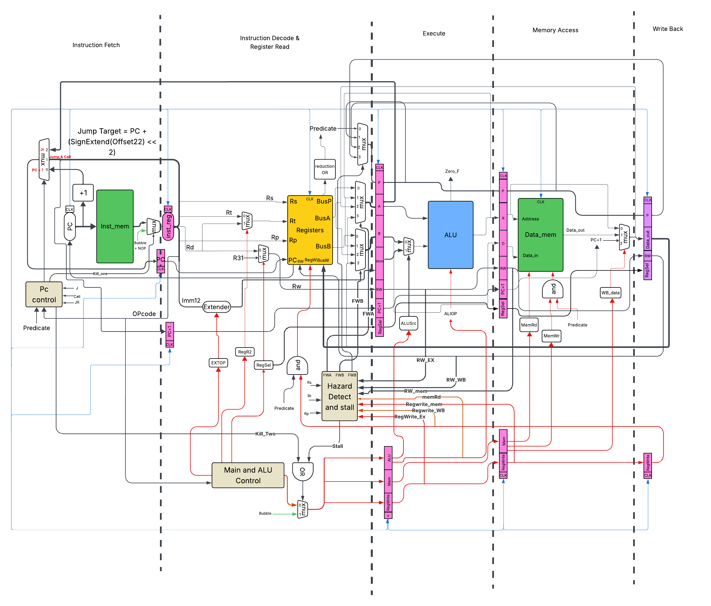

# Pipelined RISC Processor with Predicated Execution

A 5-stage pipelined RISC processor implementation in Verilog HDL featuring predicated execution, comprehensive hazard detection, data forwarding, and advanced control flow management.



## 🎯 Overview

This project implements a **predicated execution pipelined processor** based on RISC architecture principles. The processor features a classic 5-stage pipeline with sophisticated hazard handling mechanisms, including both forwarding and stalling techniques, and supports predicated instruction execution for conditional operations.

### Key Features

- ✅ **5-Stage Pipeline Architecture**: Fetch → Decode → Execute → Memory → Write-Back
- ✅ **Predicated Execution**: Conditional instruction execution based on predicate registers
- ✅ **Advanced Hazard Detection**: Comprehensive data, control, and structural hazard management
- ✅ **Data Forwarding Unit**: Three-level forwarding (EX, MEM, WB stages) to minimize stalls
- ✅ **Load-Use Hazard Handling**: Automatic stall insertion for memory dependencies
- ✅ **32 General-Purpose Registers**: Including special-purpose registers (R0, R30, R31)
- ✅ **Flexible Instruction Set**: Arithmetic, logical, memory, and control flow instructions
- ✅ **Branch/Jump Support**: J, CALL, and JR with predicate-based execution

## 📋 Table of Contents

- [Architecture](#architecture)
- [Instruction Set Architecture (ISA)](#instruction-set-architecture-isa)
- [Pipeline Stages](#pipeline-stages)
- [Hazard Handling](#hazard-handling)
- [Register File](#register-file)
- [Directory Structure](#directory-structure)
- [Getting Started](#getting-started)
- [Simulation](#simulation)
- [Documentation](#documentation)
- [Design Decisions](#design-decisions)
- [Performance](#performance)
- [License](#license)

## 🏗️ Architecture

### Pipeline Overview

The processor implements a classic 5-stage RISC pipeline:

```
┌─────────┐    ┌─────────┐    ┌─────────┐    ┌─────────┐    ┌─────────┐
│  FETCH  │ -> │ DECODE  │ -> │ EXECUTE │ -> │ MEMORY  │ -> │  WRITE  │
│  (IF)   │    │  (ID)   │    │  (EX)   │    │  (MEM)  │    │  BACK   │
└─────────┘    └─────────┘    └─────────┘    └─────────┘    └─────────┘
     |              |              |              |              |
     └──────────────┴──────────────┴──────────────┴──────────────┘
                    Pipeline Registers (F→D→E→M→WB)
```

### Pipeline Registers

Each pipeline stage is separated by dedicated pipeline registers that propagate control signals and data:

- **F_TO_D_reg**: Fetch → Decode (Instruction, PC)
- **D_TO_E_reg**: Decode → Execute (ALU operands, control signals)
- **E_TO_MEM_reg**: Execute → Memory (ALU result, memory data)
- **MEM_TO_WB_reg**: Memory → Write-Back (final data, destination register)

### Key Components

#### 1. **Instruction Fetch (IF)**
- **Program Counter (PC)**: Maintains current instruction address
- **Instruction Memory**: 32-bit instruction storage
- **PC Control**: Determines next PC value (PC+1, jump target, or jump register)

#### 2. **Instruction Decode (ID)**
- **Register File**: 32×32-bit register array
- **Main Control Unit**: Generates all control signals from opcode
- **Immediate Extension**: Sign/zero extension for 12-bit immediates
- **Hazard Detection**: Identifies potential data hazards

#### 3. **Execute (EX)**
- **ALU**: Arithmetic and logical operations
- **ALU Control**: Determines ALU operation from opcode
- **Forwarding Multiplexers**: Select correct operand sources
- **Address Calculation**: Computes memory addresses

#### 4. **Memory (MEM)**
- **Data Memory**: Load/Store operations
- **Write-Back Multiplexer**: Selects data source for register write

#### 5. **Write-Back (WB)**
- **Register Update**: Writes result back to register file
- **Predicate Check**: Validates predicate before write

## 📖 Instruction Set Architecture (ISA)

### Instruction Format

```
┌──────────┬──────┬──────┬──────┬─────────────────────┐
│  Opcode  │  Rp  │  Rd  │  Rs  │    Rt / Imm / Off   │
│  (5-bit) │(5-bit)│(5-bit)│(5-bit)│    (12-bit)        │
└──────────┴──────┴──────┴──────┴─────────────────────┘
     31-27   26-22  21-17  16-12        11-0
```

- **Rp**: Predicate register (determines if instruction executes)
- **Rd**: Destination register
- **Rs**: Source register 1
- **Rt**: Source register 2 (R-type) or immediate/offset (I-type)

### Supported Instructions

#### Arithmetic Instructions
| Instruction | Opcode | Format | Description |
|------------|--------|--------|-------------|
| `ADD Rp,Rd,Rs,Rt` | 0 | R-type | Rd = Rs + Rt (if Rp ≠ 0) |
| `SUB Rp,Rd,Rs,Rt` | 1 | R-type | Rd = Rs - Rt (if Rp ≠ 0) |
| `ADDI Rp,Rd,Rs,Imm` | 5 | I-type | Rd = Rs + SignExt(Imm) (if Rp ≠ 0) |

#### Logical Instructions
| Instruction | Opcode | Format | Description |
|------------|--------|--------|-------------|
| `OR Rp,Rd,Rs,Rt` | 2 | R-type | Rd = Rs \| Rt (if Rp ≠ 0) |
| `NOR Rp,Rd,Rs,Rt` | 3 | R-type | Rd = ~(Rs \| Rt) (if Rp ≠ 0) |
| `AND Rp,Rd,Rs,Rt` | 4 | R-type | Rd = Rs & Rt (if Rp ≠ 0) |
| `ORI Rp,Rd,Rs,Imm` | 6 | I-type | Rd = Rs \| ZeroExt(Imm) (if Rp ≠ 0) |
| `NORI Rp,Rd,Rs,Imm` | 7 | I-type | Rd = ~(Rs \| ZeroExt(Imm)) (if Rp ≠ 0) |
| `ANDI Rp,Rd,Rs,Imm` | 8 | I-type | Rd = Rs & ZeroExt(Imm) (if Rp ≠ 0) |

#### Memory Instructions
| Instruction | Opcode | Format | Description |
|------------|--------|--------|-------------|
| `LW Rp,Rd,Rs,Offset` | 9 | I-type | Rd = Mem[Rs + SignExt(Offset)] (if Rp ≠ 0) |
| `SW Rp,Rt,Rs,Offset` | 10 | I-type | Mem[Rs + SignExt(Offset)] = Rt (if Rp ≠ 0) |

#### Control Flow Instructions
| Instruction | Opcode | Format | Description |
|------------|--------|--------|-------------|
| `J Rp,Offset` | 11 | J-type | PC = PC[31:22] \| Offset[21:0] (if Rp ≠ 0) |
| `CALL Rp,Offset` | 12 | J-type | R31 = PC+1; PC = PC[31:22] \| Offset[21:0] (if Rp ≠ 0) |
| `JR Rp,Rs` | 13 | R-type | PC = Rs (if Rp ≠ 0) |

### ALU Operations

The ALU supports the following operations (controlled by 3-bit ALUOP):

| ALUOP | Operation | Description |
|-------|-----------|-------------|
| 000 | ADD | BusA + BusB |
| 001 | SUB | BusA - BusB |
| 010 | OR | BusA \| BusB |
| 011 | NOR | ~(BusA \| BusB) |
| 100 | AND | BusA & BusB |

## 🔄 Pipeline Stages

### Stage 1: Instruction Fetch (IF)

```verilog
// PC update logic
PC_next = (PCSrc == 2'b01) ? PC_JumpTarget :    // Jump/Call
          (PCSrc == 2'b10) ? PC_JR :            // Jump Register
                             PC + 1;            // Normal increment
```

**Operations:**
1. Fetch instruction from instruction memory at PC
2. Calculate PC+1 for sequential execution
3. Determine next PC based on control flow

### Stage 2: Instruction Decode (ID)

**Operations:**
1. Decode instruction fields (opcode, registers, immediate)
2. Read source registers (Rs, Rt, Rp) from register file
3. Generate control signals from main control unit
4. Extend immediate value (sign or zero extension)
5. **Hazard Detection**: Check for load-use hazards
6. **Data Forwarding**: Apply forwarding from later stages

**Special Features:**
- **Predicate Register Read**: Fetches Rp value for conditional execution
- **Forwarding Multiplexers**: 4-to-1 muxes select from (Register, EX, MEM, WB)
- **Stall Logic**: Inserts NOP if load-use hazard detected

### Stage 3: Execute (EX)

**Operations:**
1. Select ALU source (register or immediate)
2. Perform ALU operation based on ALUOP
3. Calculate memory address for load/store
4. Propagate predicate and control signals

**ALU Operations:**
```verilog
case (ALUOP)
    3'b000: RES = BusA + BusB;        // Addition
    3'b001: RES = BusA - BusB;        // Subtraction
    3'b010: RES = BusA | BusB;        // OR
    3'b011: RES = ~(BusA | BusB);     // NOR
    3'b100: RES = BusA & BusB;        // AND
endcase
```

### Stage 4: Memory Access (MEM)

**Operations:**
1. Perform memory read (LW instruction)
2. Perform memory write (SW instruction) if predicate is true
3. Pass through ALU result for non-memory instructions

**Memory Interface:**
```verilog
Data_Memory:
    - Read:  data_out = Memory[address]  (if MEMRd = 1)
    - Write: Memory[address] = data_in   (if MEMWr = 1 && Predicate = 1)
```

### Stage 5: Write-Back (WB)

**Operations:**
1. Select final result source:
   - ALU result (arithmetic/logical instructions)
   - Memory data (load instruction)
   - PC+1 (CALL instruction for return address)
2. Write result to destination register if predicate is true

**Write-Back Multiplexer:**
```verilog
WB Data Selection:
    WB[1:0] = 00 → ALU Result
    WB[1:0] = 01 → Memory Data
    WB[1:0] = 10 → PC+1 (for CALL)
```

## ⚠️ Hazard Handling

### 1. Data Hazards

#### Data Forwarding

The processor implements a comprehensive 3-level forwarding network:

```
Forwarding Priority (highest to lowest):
1. EX Stage  → ID Stage  (FW = 01)
2. MEM Stage → ID Stage  (FW = 10)
3. WB Stage  → ID Stage  (FW = 11)
```

**Forwarding Logic:**
```verilog
// Forward from EX/MEM if:
// 1. Source register != 0 (not hardwired zero)
// 2. Source register != 30 (not PC)
// 3. Destination register matches source register
// 4. Destination is being written (RegWrite = 1)

Example:
  ADD R1, R2, R3    # EX stage: Writing to R1
  SUB R4, R1, R5    # ID stage: Reading R1
  → Forward R1 value from EX stage to SUB instruction
```

**Forwarding Paths:**
- **FWA** (Forward to BusA/Rs): Three 4-to-1 multiplexer
- **FWB** (Forward to BusB/Rt): Three 4-to-1 multiplexer
- **FWP** (Forward to BusP/Rp): Three 4-to-1 multiplexer

#### Load-Use Hazard (Stalling)

When a load instruction is immediately followed by an instruction that uses the loaded data, forwarding alone is insufficient (data not available until MEM stage).

**Solution: Pipeline Stall**

```verilog
Example Requiring Stall:
  LW  R1, 0(R2)     # Load R1 from memory
  ADD R3, R1, R4    # Use R1 immediately → STALL
  
Pipeline Behavior:
  Cycle 1: LW in EX
  Cycle 2: LW in MEM, ADD stalled in ID (NOP inserted in EX)
  Cycle 3: LW in WB, ADD in EX (forwarded from WB)
```

**Stall Condition:**
```verilog
Stall = 1 if:
  - Instruction in EX is a load (MEMRd = 1)
  - Destination register (RW_EX) matches Rs, Rt, or Rp in ID
  - Registers are not R0 or R30
```

### 2. Control Hazards

Control hazards occur with branch/jump instructions.

**Solution: Flush + Predicate-Based Execution**

```verilog
// When jump taken (J, CALL, JR):
if (PCSrc != 2'b00 && Predicate == 1)
    Flush = 1;  // Cancel instruction in IF stage

// Flush converts the fetched instruction to NOP
```

**Branch Resolution:**
- Branches resolved in **Decode Stage** (early resolution)
- If branch taken, flush instruction in Fetch stage
- Minimize branch penalty to 1 cycle

### 3. Special Case: CALL/R31 Forwarding

The CALL instruction writes PC+1 to R31 (return address register). Special forwarding logic handles JR R31 immediately after CALL.

```verilog
CALL → R31
JR R31         # Needs forwarding from WB stage
```

## 📁 Directory Structure

```
PipelinedProcessor/
│
├── RTL/                          # Hardware Description (Verilog source files)
│   ├── CPU.v                    # Top-level CPU module (in TestBench/)
│   ├── ALU.v                    # Arithmetic Logic Unit
│   ├── ALU_control.v            # ALU operation decoder
│   ├── Main_Control.v           # Main control unit (generates all control signals)
│   ├── Pc_control.v             # Program counter control (branch/jump logic)
│   ├── Hazard_Detect_And_Stall.v # Hazard detection & forwarding unit
│   │
│   ├── REG_file.v               # 32×32-bit register file with PC
│   ├── Inst_mem.v               # Instruction memory
│   ├── Data_mem.v               # Data memory
│   │
│   ├── F_TO_D_reg.v             # Fetch-to-Decode pipeline register
│   ├── D_TO_E_reg.v             # Decode-to-Execute pipeline register
│   ├── E_TO_MEM_reg.v           # Execute-to-Memory pipeline register
│   ├── MEM_TO_WB_reg.v          # Memory-to-WriteBack pipeline register
│   │
│   ├── mux2x1.v                 # 2-to-1 multiplexer (32-bit)
│   ├── mux2x1_5bit.v            # 2-to-1 multiplexer (5-bit)
│   ├── mux4x1.v                 # 4-to-1 multiplexer (32-bit)
│   ├── FWmux4x1.v               # 4-to-1 forwarding multiplexer
│   └── Mux8x3.v                 # 8-to-1 multiplexer (3-bit select)
│
├── TestBench/                   # Verification & Testing
│   └── CPU.v                    # Main CPU integration (testbench wrapper)
│
├── Docs/                        # Documentation
│   ├── Project_Report.pdf       # Detailed project report
│   ├── Project-Documentation.pdf # Additional documentation
│   └── Processor-Datapath.png   # Datapath block diagram
│
└── README.md                    # This file
```

## 🚀 Getting Started

### Prerequisites

- **Verilog Simulator**: ModelSim, Vivado, Icarus Verilog, or any HDL simulator
- **Waveform Viewer**: GTKWave, ModelSim viewer, or Vivado simulator
- **Basic Knowledge**: Computer architecture and Verilog HDL

### Quick Start

#### Option 1: ModelSim

```bash
# 1. Clone the repository
git clone https://github.com/yourusername/pipelined-processor.git
cd pipelined-processor

# 2. Compile all Verilog files
vlog RTL/*.v TestBench/CPU.v

# 3. Simulate
vsim -c CPU -do "run -all; quit"

# 4. View waveforms
vsim CPU
# In GUI: add waves and run simulation
```

#### Option 2: Icarus Verilog

```bash
# 1. Compile
iverilog -o cpu_sim RTL/*.v TestBench/CPU.v

# 2. Run simulation
vvp cpu_sim

# 3. View waveform
gtkwave dump.vcd
```

#### Option 3: Vivado

```bash
# 1. Create new project in Vivado
# 2. Add all .v files from RTL/ and TestBench/
# 3. Set CPU.v as top module
# 4. Run behavioral simulation
```

### Running Simulations

1. **Load Test Program**: Modify `Inst_mem.v` with your instruction sequence
2. **Set Initial Register Values**: Edit `REG_file.v` reset values
3. **Configure Memory**: Set data memory initial values in `Data_mem.v`
4. **Run Simulation**: Execute for desired number of clock cycles
5. **Analyze Results**: Check register values, memory contents, and waveforms

### Example Test Program

```assembly
# Simple program: Add two numbers and store result
# Assumes R1=100, R2=150 (set in REG_file.v reset)

ADDI R10, R1, R0, 0    # R1 = R1 + 0 (move R1 to R1)
ADD  R10, R3, R1, R2   # R3 = R1 + R2 = 100 + 150 = 250
SW   R10, R3, R0, 10   # Mem[10] = R3 = 250
LW   R10, R4, R0, 10   # R4 = Mem[10] = 250
```

## 📊 Register File

### Special Registers

| Register | Purpose | Special Behavior |
|----------|---------|------------------|
| **R0** | Hardwired Zero | Always reads 0, writes ignored |
| **R30** | Program Counter | Updated every cycle (unless stalled) |
| **R31** | Return Address | Stores PC+1 for CALL instruction |

### General Purpose Registers

- **R1 - R29**: General-purpose registers for data storage
- **Predicate Registers**: Any register can be used as predicate
  - **R10**: Initialized to 0 (false predicate example)
  - **R20**: Initialized to 1 (true predicate example)

### Initial Register Values (for testing)

```verilog
Register[0]  = 32'd0;    // Hardwired zero
Register[1]  = 32'd100;  // Test value 1
Register[2]  = 32'd150;  // Test value 2
Register[3]  = 32'd10;   // Test value 3
Register[4]  = 32'd20;   // Test value 4
Register[5]  = 32'd255;  // Test value 5
Register[6]  = 32'd240;  // Test value 6
Register[10] = 32'd0;    // False predicate
Register[20] = 32'd1;    // True predicate
Register[30] = 32'd0;    // PC
Register[31] = 32'd0;    // Return address
```

## 🎓 Design Decisions

### 1. Predicated Execution

**Why?** Reduces branch penalties and improves performance for conditional operations.

**Implementation:**
- Every instruction has a predicate register field (Rp)
- Instruction executes only if `Register[Rp] != 0`
- Predicate checked in Write-Back stage
- Special handling for R0 (always false) vs other zero-valued registers

### 2. Three-Level Forwarding

**Why?** Maximizes data availability and minimizes stalls.

**Trade-offs:**
- **Pros**: Reduces pipeline stalls significantly
- **Cons**: Increased hardware complexity (3× 4-to-1 muxes per operand)

### 3. Load-Use Stalling

**Why?** Data from memory not available until MEM stage.

**Alternative Considered**: Compiler scheduling (reorder instructions)
**Chosen**: Hardware stalling for simplicity and correctness

### 4. Single-Cycle Memory

**Why?** Simplifies design for educational purposes.

**Real-World**: Would use cache hierarchy with multi-cycle access

### 5. PC in Register File (R30)

**Why?** Allows efficient PC-relative addressing and debugging.

**Trade-off**: Uses one general-purpose register slot

## 📈 Performance

### Pipeline Efficiency

**Ideal CPI (Cycles Per Instruction)**: 1.0 (fully pipelined)

**Actual CPI**: ~1.1 - 1.3 (depending on program)

**Performance Penalties:**
- **Load-Use Hazard**: 1 cycle stall
- **Branch/Jump Taken**: 1 cycle flush (if predicate true)
- **Structural Hazards**: None (separate instruction/data memory)

### Hazard Statistics (Example Program)

```
Total Instructions: 100
Pipeline Stalls: 8 (load-use hazards)
Pipeline Flushes: 5 (control hazards)
Total Cycles: 113
CPI = 113 / 100 = 1.13
```

### Optimization Opportunities

1. **Branch Prediction**: Add simple predictor to reduce flush penalty
2. **Dual-Port Register File**: Allow simultaneous read/write to same register
3. **Cache**: Multi-level cache for realistic memory hierarchy
4. **Superscalar**: Multiple issue for ILP exploitation

## 📚 Documentation

Detailed documentation is available in the `Docs/` directory:

- **[Project_Report.pdf](Docs/Project_Report.pdf)**: Complete project documentation with architecture details, design decisions, and test results
- **[Project-Documentation.pdf](Docs/Project-Documentation.pdf)**: Additional implementation notes and specifications
- **[Processor-Datapath.png](Docs/Processor-Datapath.png)**: Visual representation of the complete datapath

### Key Documentation Sections

1. Architecture overview and design rationale
2. Detailed instruction set architecture (ISA)
3. Pipeline stage descriptions
4. Hazard handling mechanisms
5. Test programs and verification results
6. Performance analysis
7. Future enhancements

## 🧪 Testing & Verification

### Test Methodology

1. **Unit Testing**: Individual module verification (ALU, Control, etc.)
2. **Integration Testing**: Pipeline stage integration
3. **System Testing**: Complete CPU with test programs
4. **Edge Cases**: Hazard scenarios, predicate conditions, boundary values

### Sample Test Cases

#### Test 1: Basic Arithmetic
```assembly
ADD  R20, R7, R1, R2   # R7 = 100 + 150 = 250
SUB  R20, R8, R7, R3   # R8 = 250 - 10 = 240
```

#### Test 2: Load-Use Hazard
```assembly
LW   R20, R10, R0, 5   # R10 = Mem[5]
ADD  R20, R11, R10, R1 # Stall 1 cycle, then R11 = R10 + R1
```

#### Test 3: Data Forwarding
```assembly
ADD  R20, R7, R1, R2   # R7 = 100 + 150
SUB  R20, R8, R7, R3   # Forward R7 from EX → R8 = 250 - 10
OR   R20, R9, R8, R4   # Forward R8 from MEM → R9 = 240 | 20
```

#### Test 4: Predicated Execution
```assembly
ADD  R20, R7, R1, R2   # Executes (R20 = 1)
ADD  R10, R8, R3, R4   # Does NOT execute (R10 = 0)
```

#### Test 5: CALL and Return
```assembly
CALL R20, 100          # R31 = PC+1, jump to address 100
...                    # Subroutine code
JR   R20, R31          # Return (PC = R31)
```


## 🏆 Acknowledgments

- Based on classic RISC pipeline architecture principles
- Inspired by MIPS and ARM processor designs
- Developed as part of Computer Architecture coursework
- Special thanks to instructors and teaching assistants

## 📄 License

This project is licensed under the MIT License - see the [LICENSE](LICENSE) file for details.

```
MIT License

Copyright (c) 2026 Adnan Odeh

Permission is hereby granted, free of charge, to any person obtaining a copy
of this software and associated documentation files (the "Software"), to deal
in the Software without restriction, including without limitation the rights
to use, copy, modify, merge, publish, distribute, sublicense, and/or sell
copies of the Software, and to permit persons to whom the Software is
furnished to do so, subject to the following conditions:

The above copyright notice and this permission notice shall be included in all
copies or substantial portions of the Software.
```

## 📞 Contact

**Project Maintainer**: Adnan Odeh
- GitHub: [@yourusername](https://github.com/AdnanOdeh04)
- Email: adnanodeh2004@gmail.com
- LinkedIn: [Your LinkedIn]([https://linkedin.com/in/yourprofile](https://www.linkedin.com/in/adnan-odeh-0590a9274/))

**Project Link**: [https://github.com/yourusername/pipelined-processor](https://github.com/AdnanOdeh04/Pipelined-Predicted-RISC-Processor)

---

## 🔧 Troubleshooting

### Common Issues

**Issue**: Simulation doesn't start
- **Solution**: Ensure all `.v` files are compiled in correct order

**Issue**: Incorrect results
- **Solution**: Check initial register values in `REG_file.v`
- **Solution**: Verify instruction encoding in `Inst_mem.v`

**Issue**: Forwarding not working
- **Solution**: Check `Hazard_Detect_And_Stall.v` forwarding conditions
- **Solution**: Verify FWA/FWB/FWP signal connections

**Issue**: Pipeline stalls too frequently
- **Solution**: Review load-use hazard patterns in your test program
- **Solution**: Add NOPs manually or reorder instructions

---

## 📊 Project Statistics

- **Total Lines of Code**: ~2000+ lines
- **Number of Modules**: 20+
- **Pipeline Depth**: 5 stages
- **Register File Size**: 32 registers × 32 bits
- **Instruction Set**: 14 instructions
- **Forwarding Paths**: 9 (3 operands × 3 stages)

---

## 🎯 Learning Outcomes

After working with this project, you will understand:

1. ✅ Pipeline architecture and hazard handling
2. ✅ Data forwarding and stalling mechanisms
3. ✅ Predicated execution for conditional operations
4. ✅ Control flow management (branches, jumps, calls)
5. ✅ Register file design with special-purpose registers
6. ✅ Memory hierarchy (instruction/data separation)
7. ✅ HDL design and verification techniques
8. ✅ Performance analysis and optimization

---

**⭐ If you find this project useful, please consider giving it a star on GitHub!**
